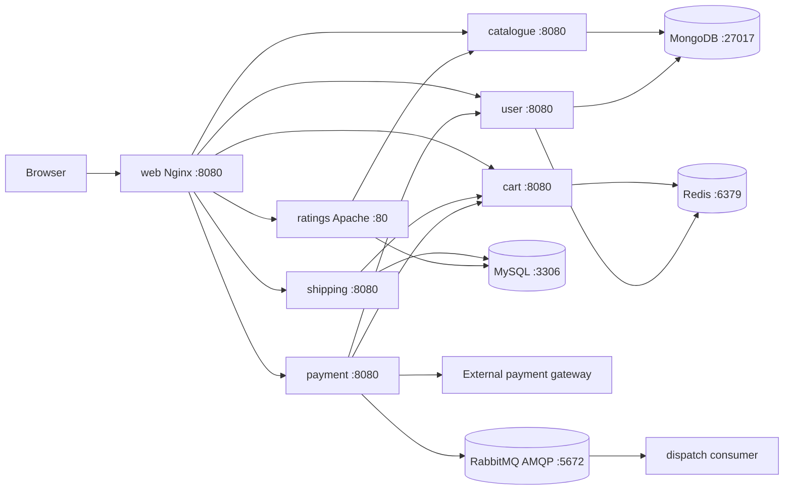

# Azure SRE Troubleshooting Knowledge Base

## Scope and operating assumptions

This repository is Stan's Robot Shop, a multi-service e-commerce demo. The application is designed for Docker Compose and Kubernetes/Helm. It has intentionally limited error handling and no built-in authentication between services. Treat this document as repository-specific operational knowledge, not as a security or production-readiness assessment.

## Architecture at a glance



### Dependency graph

- `web` depends on `catalogue`, `user`, `cart`, `shipping`, `payment`, and `ratings` for the user-facing API.
- `catalogue` depends on MongoDB database `catalogue`.
- `user` depends on MongoDB database `users` and Redis.
- `cart` depends on Redis and calls `catalogue` when adding a product.
- `shipping` depends on MySQL database `cities` and calls `cart` when confirming shipping.
- `ratings` depends on MySQL database `ratings` and calls `catalogue` to validate SKUs.
- `payment` depends on `user`, `cart`, RabbitMQ, and the configured external payment gateway.
- `dispatch` depends on RabbitMQ and consumes the `orders` queue.
- MongoDB, MySQL, Redis, and RabbitMQ are foundational dependencies. A failure in one can fan out to multiple application pods.

`depends_on` in Compose controls start order only. It does not prove that a dependency is ready. Catalogue and user retry MongoDB every two seconds; dispatch reconnects to RabbitMQ; other services may start while their dependency is still unavailable.

## Runtime inventory

| Component | Runtime | Default service DNS | Port | State or external dependency | Health/diagnostic endpoint |
|---|---|---:|---:|---|---|
| web | Nginx | `web` | 8080 | Proxies all user-facing APIs | `/nginx_status` if enabled by config |
| catalogue | Node.js/Express | `catalogue` | 8080 | MongoDB `catalogue.products` | `/health`, returns `mongo` flag |
| user | Node.js/Express | `user` | 8080 | MongoDB `users.users` and `users.orders`; Redis counter | `/health`, returns Mongo flag only |
| cart | Node.js/Express | `cart` | 8080 | Redis cart documents; catalogue lookup | `/health`, returns Redis flag; `/metrics` |
| payment | Python Flask/uWSGI | `payment` | 8080 | user, cart, RabbitMQ, external gateway | `/health`; `/metrics` |
| dispatch | Go consumer | `dispatch` | no HTTP API | RabbitMQ exchange/queue | Logs only; no HTTP health endpoint |
| shipping | Java Spring Boot | `shipping` | 8080 | MySQL `cities`; cart confirmation | `/health`; Spring actuator is included but not exposed by explicit config |
| ratings | PHP Apache | `ratings` | 80 in Compose/K8s Helm | MySQL `ratings`; catalogue SKU validation | `/_health`; `/server-status` |
| MongoDB | Mongo 5 image | `mongodb` | 27017 | Compose volume `mongodb-data` | MongoDB client/ping |
| MySQL | MySQL 5.7 image | `mysql` | 3306 | Compose volume `mysql-data` | MySQL client/query |
| Redis | Redis 6.2 Alpine | `redis` | 6379 | Compose volume `redis-data` | `redis-cli ping` |
| RabbitMQ | RabbitMQ management image | `rabbitmq` | 5672 AMQP, 15672 management | Durable `robot-shop` exchange and `orders` queue | AMQP connection or management UI |

## Service contracts and failure behavior

### web

Nginx routes:

- `/api/catalogue/` -> `${CATALOGUE_HOST}:8080`
- `/api/user/` -> `${USER_HOST}:8080`
- `/api/cart/` -> `${CART_HOST}:8080`
- `/api/shipping/` -> `${SHIPPING_HOST}:8080`
- `/api/payment/` -> `${PAYMENT_HOST}:8080`
- `/api/ratings/` -> `${RATINGS_HOST}:80`

A web pod can be Running while an upstream is unreachable. For a user-facing 502/504, inspect the Nginx upstream name, Service endpoints, and the target pod before restarting web.

**Known wiring trap:** root `docker-compose.yaml` sets `RATING_HOST` (singular), but Nginx and `web/Dockerfile` use `RATINGS_HOST` (plural). The image default masks this in some deployments, but the Compose override does not replace the expected variable. Verify the generated `/etc/nginx/conf.d/default.conf` and correct the deployment environment if ratings traffic fails.

### catalogue

- Mongo URL: `MONGO_URL`, default `mongodb://mongodb:27017/catalogue`.
- Database/collection: `catalogue.products`.
- Endpoints: `/products`, `/products/{category}`, `/product/{sku}`, `/categories`, `/search/{text}`, `/health`.
- Startup behavior: listens on port 8080 immediately and retries MongoDB connection every two seconds.
- Health is shallow: HTTP 200 can still be returned with `{ "mongo": false }`; check the JSON field, not only the status code.
- Search requires the text index created by `mongo/catalogue.js`; a missing index can break `/search` while basic product lookup works.

### user

- Mongo URL: `MONGO_URL`, default `mongodb://mongodb:27017/users`.
- Code explicitly selects database `users`, collections `users` and `orders`.
- Redis host: `REDIS_HOST`, default `redis`.
- Endpoints: `/health`, `/uniqueid`, `/check/{id}`, `/users`, `/login`, `/register`, `/order/{id}`, `/history/{id}`.
- `/uniqueid` requires Redis; login/register/history/check require MongoDB.
- Health reports only Mongo connectivity and does not report Redis, so test `/uniqueid` separately when anonymous checkout fails.
- Mongo initialization in `mongo/users.js` creates sample users and a unique name index. Initialization scripts run only for a new Mongo data directory.

### cart

- Redis host: `REDIS_HOST`, default `redis`.
- Catalogue host: `CATALOGUE_HOST`, default `catalogue`.
- Cart data is stored as JSON in Redis keyed by cart/user ID.
- Endpoints: `/health`, `/metrics`, `/cart/{id}`, `/add/{id}/{sku}/{qty}`, `/update/{id}/{sku}/{qty}`, `/rename/{from}/{to}`, and delete `/cart/{id}`.
- `/add` first calls catalogue `/product/{sku}`, then reads/writes Redis. Product lookup failures and Redis failures both surface as cart errors.
- Redis data is ephemeral from the application perspective. A Redis volume exists in Compose, but loss or replacement of the volume loses carts and the anonymous counter.

### payment

- Flask application behind uWSGI on port 8080.
- Hosts: `CART_HOST` default `cart`, `USER_HOST` default `user`, `AMQP_HOST` default `rabbitmq`.
- External gateway: `PAYMENT_GATEWAY`, default is `https://paypal.com/`; root Compose overrides it to `https://www.paypal.com/`.
- Endpoint: `POST /pay/{id}`.
- Flow: check user -> validate cart contains nonzero total and `SHIP` item -> call external gateway -> publish order -> write registered-user history -> delete cart.
- RabbitMQ publisher declares durable direct exchange `robot-shop` and publishes routing key `orders`.
- A failure after the external gateway call can leave partial order state. Inspect logs and RabbitMQ before retrying payment to avoid duplicate business actions.
- `/health` only returns `OK`; it does not prove user, cart, gateway, or RabbitMQ connectivity. `/metrics` is useful for purchase counters.

### dispatch

- Go process with no HTTP server and no Kubernetes-native HTTP health endpoint in the source.
- AMQP host: `AMQP_HOST`, default `rabbitmq`; URI is `amqp://guest:guest@<host>:5672/`.
- Declares exchange `robot-shop` (direct, durable), queue `orders` (durable), and binding routing key `orders`.
- Consumes with auto-ack enabled. A message is considered delivered as soon as RabbitMQ sends it; a process crash after delivery can lose the simulated dispatch event.
- Reconnects to RabbitMQ after connection close. `DISPATCH_ERROR_PERCENT` injects simulated processing errors from 0 to 100; it defaults to 0.
- Troubleshoot through pod logs, RabbitMQ queue depth, and message publish/consume counters rather than HTTP probes.

### shipping

- MySQL host: `DB_HOST`, default `mysql`; JDBC database is `cities`.
- MySQL credentials are hard-coded in source/config: user `shipping`, password `secret`.
- Cart URL: `CART_ENDPOINT`, default `cart`; root Compose sets `cart:8080`. The code appends `/shipping/{id}`.
- Endpoints: `/health`, `/count`, `/codes`, `/cities/{code}`, `/match/{code}/{text}`, `/calc/{id}`, `/confirm/{id}`.
- `/calc/{id}` reads a city from MySQL and calculates shipping cost. `/confirm/{id}` posts a shipping item to cart and returns the cart response.
- MySQL initialization creates database `cities` and user `shipping`. The actual city dataset must be present for `/count`, `/cities`, and `/calc` to work.
- `/health` is an application response and does not by itself prove the query path is healthy; use `/count` and MySQL connectivity as a functional check.

### ratings

- PHP 7.4 Apache on port 80 in its container.
- PDO URL: `PDO_URL`, default `mysql:host=mysql;dbname=ratings;charset=utf8mb4`.
- MySQL credentials: user `ratings`, password `iloveit`.
- Catalogue URL: `CATALOGUE_URL`, default `http://catalogue:8080`.
- Endpoints: `GET /fetch/{sku}`, `PUT /rate/{sku}/{score}`, `GET /_health`.
- `/_health` performs `SELECT 1 + 1 FROM DUAL` and returns HTTP 200 only when PDO connectivity succeeds.
- Rating writes first call catalogue to validate the SKU, then insert/update MySQL. A healthy ratings pod can still fail writes if catalogue is unavailable.
- MySQL initialization creates `ratings.ratings(sku, avg_rating, rating_count)`. The seed SQL shown in this repository creates the table but does not populate ratings rows.

## Data initialization and persistence

### MongoDB

- Image: Mongo 5.
- Compose volume: `mongodb-data:/data/db`.
- Initialization scripts: `mongo/catalogue.js`, `mongo/users.js`.
- Scripts run only when MongoDB initializes an empty data directory. Restarting a pod with an existing PVC will not re-run them.
- Check both databases: `catalogue` and `users`.

### MySQL

- Image: MySQL 5.7.
- Compose volume: `mysql-data:/var/lib/mysql`; image changes the internal data directory to `/data/mysql`.
- Environment: empty root password, database `cities`, user `shipping`/`secret.
- `mysql/scripts/20-ratings.sql` creates database `ratings`, table `ratings`, and user `ratings`/`iloveit`.
- Initialization scripts also run only on an empty data directory. A failed first initialization may require inspecting the data directory and logs before any data reset.

### Redis

- Image: Redis 6.2 Alpine.
- Compose volume: `redis-data:/data`.
- Stores carts and `anonymous-counter`; there is no application-level backup or replication configuration in this repository.

### RabbitMQ

- Exchange: `robot-shop`, type `direct`, durable.
- Queue: `orders`, durable, bound with routing key `orders`.
- Default credentials are `guest`/`guest`.
- Root Compose exposes management on 15672 and AMQP on 5672. In Kubernetes, verify the Service ports and endpoints because manifest variants differ.

## First-response incident procedure for AKS/Kubernetes

Set the namespace and release before running commands. Do not delete pods until logs, events, and dependency state have been captured.

```bash
kubectl -n <namespace> get pods -o wide
kubectl -n <namespace> get svc,endpoints
kubectl -n <namespace> get events --sort-by=.lastTimestamp | tail -50
kubectl -n <namespace> describe pod <pod>
kubectl -n <namespace> logs <pod> --all-containers --since=30m
kubectl -n <namespace> logs <pod> --previous
```

For a service-level failure:

```bash
kubectl -n <namespace> get deploy,sts,pods -l app=<service>
kubectl -n <namespace> describe svc <service>
kubectl -n <namespace> get endpoints <service> -o yaml
kubectl -n <namespace> exec deploy/<caller> -- sh -c 'getent hosts <dependency>; wget -qO- http://<dependency>:<port>/health'
```

Use an ephemeral debug pod if the caller image has no shell or DNS tools:

```bash
kubectl -n <namespace> run netcheck --rm -it --restart=Never --image=curlimages/curl -- sh
```

For Azure platform symptoms, also check AKS node and workload state, but keep application dependency failures separate from platform failures:

```bash
az aks show -g <resource-group> -n <cluster> --query powerState
kubectl get nodes
kubectl top nodes
kubectl top pods -n <namespace>
```

## Symptom-to-check guide

| Symptom | Most likely dependency chain | Checks |
|---|---|---|
| Web returns 502/504 for one API | web -> target service -> its dependency | Check Nginx generated config, target Service endpoints, target pod logs, then the target's database/broker. |
| Catalogue `/health` has `mongo:false` | catalogue -> MongoDB | Mongo pod readiness, Service endpoints, DNS, port 27017, Mongo logs, and `MONGO_URL`. |
| User login fails but `/health` is Mongo OK | users collection or credentials/data issue | Query Mongo `users.users`; verify the initialized data exists. |
| Anonymous user/cart creation fails | user/cart -> Redis | `redis-cli ping`, Redis endpoints, `REDIS_HOST`, and `/uniqueid` or cart `/health`. |
| Add-to-cart returns product error | cart -> catalogue -> MongoDB | Call catalogue `/health` and `/product/{sku}` from cart's network; inspect SKU and Mongo collection. |
| Shipping `/count` or `/calc` fails | shipping -> MySQL `cities` | `/_health` for ratings is not sufficient; test shipping `/count`, MySQL login, database/table presence, and `DB_HOST`. |
| Shipping confirmation returns not found/empty | shipping -> cart | Call cart `/health`, verify `CART_ENDPOINT=cart:8080`, and inspect cart response for `/shipping/{id}`. |
| Ratings `/_health` is non-200 | ratings -> MySQL | Check PDO DSN, MySQL service endpoints, credentials, and `SELECT 1 + 1 FROM DUAL`. |
| Rating read works but rating write fails | ratings -> catalogue or MySQL table | Test catalogue SKU endpoint, then inspect `ratings.ratings` schema and MySQL logs. |
| Payment returns 500 or payment error | payment -> user/cart/gateway/RabbitMQ | Read payment logs in order, test each dependency from the payment pod, and verify external egress/DNS/TLS. |
| Payment succeeds but dispatch sees nothing | payment -> RabbitMQ -> dispatch | Inspect exchange/queue/binding, RabbitMQ queue depth, payment publish logs, dispatch logs, and `AMQP_HOST`. |
| Dispatch pod is Running but no processing | dispatch -> RabbitMQ | There is no HTTP health endpoint; inspect logs and broker connection/consumer state. Check `DISPATCH_ERROR_PERCENT`. |
| Pods restart during startup | resource/image/config/dependency startup | Inspect `--previous` logs, exit code, OOMKilled state, image pull events, and missing environment variables. |
| Health probes pass but user flow fails | shallow health endpoint or downstream dependency | Run a functional path: catalogue product lookup, cart add, shipping calculation, ratings health, and payment dependency checks. |

## Configuration keys to verify

| Key | Used by | Default |
|---|---|---|
| `MONGO_URL` | catalogue, user | catalogue/user-specific Mongo URLs |
| `REDIS_HOST` | cart, user | `redis` |
| `CATALOGUE_HOST` | cart, web | `catalogue` |
| `CART_HOST` | payment | `cart` |
| `USER_HOST` | payment | `user` |
| `AMQP_HOST` | payment publisher, dispatch consumer | `rabbitmq` |
| `PAYMENT_GATEWAY` | payment | `https://paypal.com/` |
| `DB_HOST` | shipping | `mysql` |
| `CART_ENDPOINT` | shipping | `cart` |
| `PDO_URL` | ratings | `mysql:host=mysql;dbname=ratings;charset=utf8mb4` |
| `CATALOGUE_URL` | ratings | `http://catalogue:8080` |
| `RATINGS_HOST` | web | `ratings` |
| `DISPATCH_ERROR_PERCENT` | dispatch | `0` |

## Evidence collection and escalation notes

Capture these before remediation:

1. Namespace, Helm release, image tags, deployment generation, and pod restart counts.
2. Pod status, exit reason, previous logs, Kubernetes events, and resource throttling/OOM data.
3. Service selectors, EndpointSlices/endpoints, DNS resolution, and network policy results.
4. Dependency health output: Mongo connectivity, Redis `PONG`, MySQL query result, RabbitMQ exchange/queue state.
5. The exact failing URL, HTTP status, request ID/trace ID, and timestamps in UTC.
6. Whether the failure is isolated to one replica, one node, one zone, or all replicas.

Do not erase PVCs or reinitialize MongoDB/MySQL as a first response. Initialization scripts are one-time operations against an empty data directory, and deleting storage can destroy the only copy of application data.
